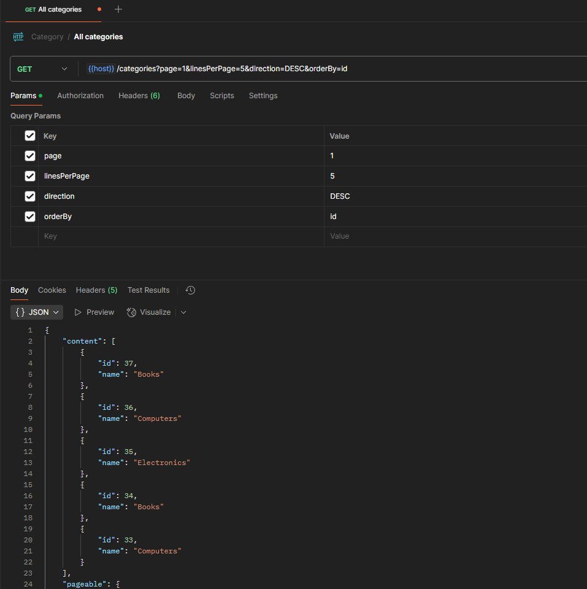
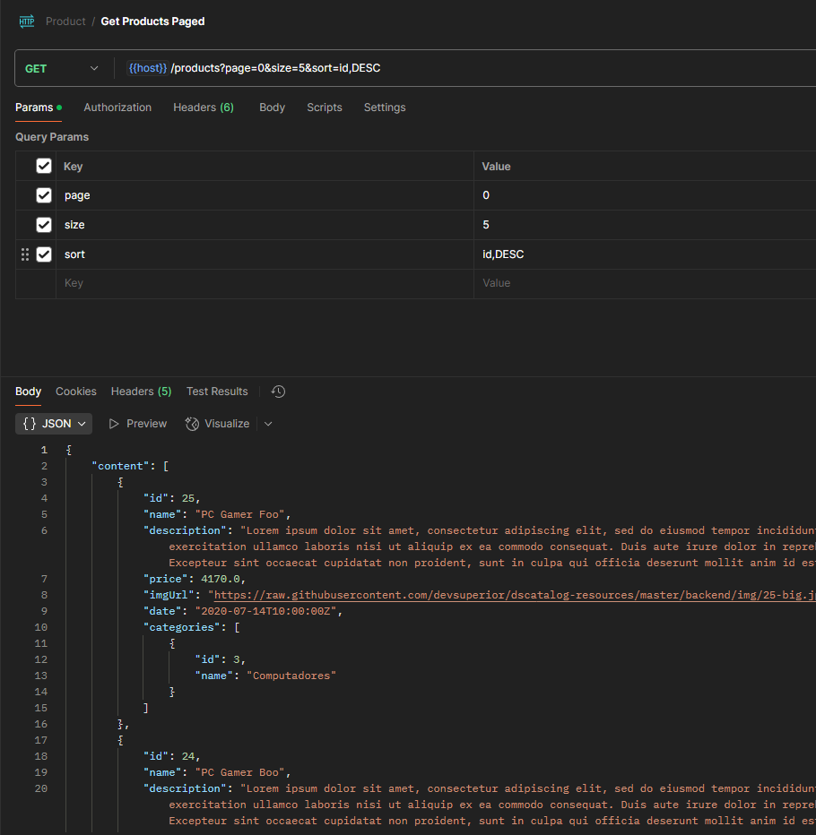
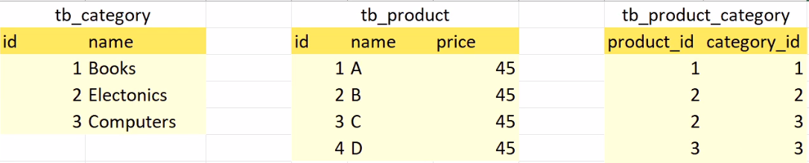
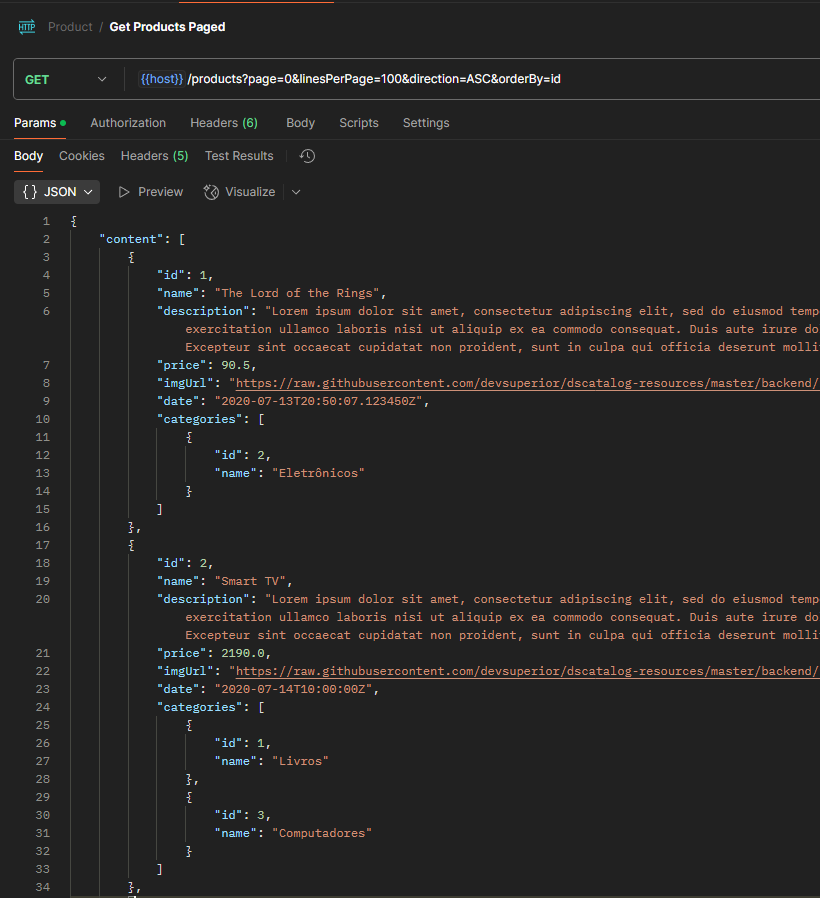
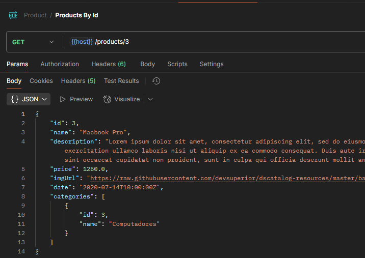
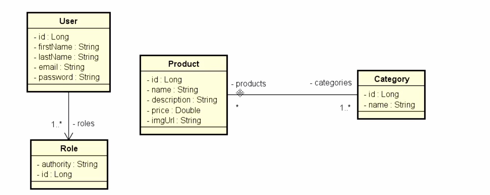

# Bootcamp Spring

## Paginação

Para começar a usar a paginação, primeiro iremos trocar o retorno para Page<T>.

```java
@GetMapping
public ResponseEntity<Page<CategoryDTO>> findAll() {
    return ResponseEntity.ok().body(categoryService.findAll());
}
```
Quando for usar paginação, podemos usar alguns parâmetros padrões na URL:
```java
//O valor tem que ser o mesmo nome da variável que vai receber o dado.

//Numero da página (0..N)
@RequestParam(value = "page", defaultValue = "0") Integer page,
//Quantidade de itens por página (1..N)
@RequestParam(value = "linesPerPage", defaultValue = "12") Integer linesPerPage,
//Como será ordenado o retorno
@RequestParam(value = "orderBy", defaultValue = "name") String orderBy,
//Ordem de ordenação (ASC ou DESC)
@RequestParam(value = "direction", defaultValue = "ASC") String direction

//Se não informar nenhum parâmetro, o valor padrão será pré definido.
```

> [!IMPORTANT]
> Use o `@RequestParam` quando for usar dados opcionais na URL. Caso seja obrigatorio, use `@PathVariable`.

```java
// Erro bobo, conflito na importação
import org.springframework.data.domain.Sort.Direction;

@GetMapping
public ResponseEntity<Page<CategoryDTO>> findAll(@RequestParam(defaultValue = "0") Integer page, @RequestParam(defaultValue = "12") Integer linesPerPage, @RequestParam(defaultValue = "name") String orderBy, @RequestParam(defaultValue = "ASC") String direction) {
    PageRequest pageRequest = PageRequest.of(page, linesPerPage, Direction.valueOf(direction), orderBy);
    Page<CategoryDTO> list = categoryService.findAllPaged(pageRequest);
    return ResponseEntity.ok().body(list);
}
```

Já no service, precisamos alterar o findAll para receber a paginação.
```java
@Transactional(readOnly = true)
public Page<CategoryDTO> findAllPaged(PageRequest pageRequest) {
    Page<Category> list = categoryRepository.findAll(pageRequest);
    return list.map(CategoryDTO::new);
}
```

e com isso ja podemos usar a paginação no endpoint pelo postman:

```bash
GET http://localhost:8080/categories?page=1&linesPerPage=5&direction=DESC&orderBy=id
```



## Paginação refatorada

### Parâmetros
- page = 0
- size = 12
- sort = name,ASC

```java
// Camada controller
@GetMapping
public ResponseEntity<Page<ProductDTO>> findAll(Pageable pageable) {
    Page<ProductDTO> list = productService.findAllPaged(pageable);
    return ResponseEntity.ok().body(list);
}   

```java
// Camada service
	@Transactional(readOnly = true)
	public Page<ProductDTO> findAllPaged(Pageable pageable) {
		Page<Product> list = productRepository.findAll(pageable);
		return list.map(x -> {
			return new ProductDTO(x, new HashSet<>(x.getCategories()));
		});
	}

```

### Resultado

```bash
GET http://localhost:8080/products?page=0&size=5&sort=id,DESC
```



## Associação muitos para muitos

Na utilização do `@ManyToMany` temos que criar uma tabela intermediaria, que irá armazenar os ids das categorias e dos produtos.

Para fazer a associação, eu criei uma coleção do tipo `Set` para armazenar os ids das categorias, pois o set é uma coleção que armazena elementos únicos, e o que eu quero é que os elementos sejam únicos entre si, ou seja, não podem repetir.



```java
//Entity: Product
@ManyToMany

//Cria uma tabela intermediaria
@JoinTable(name = "tb_product_category", 

//Pega a classe atual
joinColumns = @JoinColumn(name = "product_id"), 

//Pega o que estiver na coleção
inverseJoinColumns = @JoinColumn(name = "category_id"))
Set<Category> categories = new HashSet<>();

//Ao fazer isso o Set já tem como identifcar que seria a classe Category que será associada, pois ela herda de Category.
```

## Capítulo 1 - CRUD 

### ProductDTO

O productDTO tem que ter todos os atributos da Product, mas também tem que ter as categorias, então vamos criar um construtor com parâmetros e um construtor para receber a coleção de categorias.
```java
//Construtor padrão
public ProductDTO() {
}

//Construtor com parâmetros
public ProductDTO(Long id, String name, String description, Double price, String imgUrl, Instant date) {
    this.id = id;
    this.name = name;
    this.description = description;
    this.price = price;
    this.imgUrl = imgUrl;
    this.date = date;
}
//Copiar os atributos de outra classe para essa
public ProductDTO(Product entity) {
    BeanUtils.copyProperties(entity, this);
}
//Copiar os atributos de outra classe para essa e adicionar as categorias
public ProductDTO(Product entity, Set<Category> categories) {
    this(entity);
    categories.forEach(x -> this.categories.add(new CategoryDTO(x)));
}
```
### ProductService
O ProductService tem que ser alterado para retornar o ProductDTO com as categorias.
```java
@Transactional(readOnly = true)
public Page<ProductDTO> findAllPaged(PageRequest pageRequest) {
    Page<Product> list = productRepository.findAll(pageRequest);
    //criado uma forma de retornar o produto com as categorias
    return list.map(x -> {
        return new ProductDTO(x, new HashSet<>(x.getCategories()));
    });
}

@Transactional(readOnly = true)
public ProductDTO findById(Long id) {
    Optional<Product> list = productRepository.findById(id);
    //criado uma forma de retornar o produto com as categorias e se for nulo, lançar uma exception
    return list.map(x -> {
        return new ProductDTO(x, new HashSet<>(x.getCategories()));
    }).orElseThrow(() -> new ResourceNotFoundException("Id " + id + " not found!"));
}
```

### Resultados
#### findAll

#### findById


### Insert, Update and Delete

Para fazer o insert do produto teremos que criar um objeto do tipo Product e adicionar um método `copyDtoToEntity` para copiar os dados do dto para o entity.

```java
@Autowired
private CategoryRepository categoryRepository;

private Product copyDtoToEntity(ProductDTO dto, Product entity) {
    entity.setName(dto.getName());
    entity.setDescription(dto.getDescription());
    entity.setPrice(dto.getPrice());
    entity.setImgUrl(dto.getImgUrl());
    entity.setDate(dto.getDate());
    entity.getCategories().clear();
    for(CategoryDTO d : dto.getCategories()) {
        Category cat = categoryRepository.getReferenceById(d.getId());
        entity.getCategories().add(cat);
    }
    return entity;
}
```
Fazendo dessa forma a entidade que será salva, terá as categorias que foram passadas no dto.

> [!IMPORTANT]
> Será necessário adicionar no retorno dos métodos o atributo `getCategories()` para receber nas requisicoes as categorias do produto.
> ```java
> return new ProductDTO(entity, entity.getCategories());
> ```


## Capítulo 2 - Testes automatizados

### Tipos de testes

- Teste unitário
- Teste de integração
- Teste Funcional

1. Teste unitário não pode depender de outros componentes do sistema, somente o componente que estiver sendo testado.
2. Teste de integração pode acessar todas as camadas do sistema para realizar os testes entre elas, e recursos externos.
3. Teste Funcional é um teste do ponto de vista do usuário para validar que o sistema responde de forma esperada.

### TDD (Test Driven Development)

O TDD(Desenvolvimento guiado pelos testes) é um método de desenvolvimento de software baseado em testes.

> [!TIP]
> Não é porque seu software tenha testes, que ele é baseado em TDD.
> A modelo de desenvolvimento baseada em TDD é a seguinte:
> 1. Escrever o teste
> 2. Executar o teste
> 3. Fazer o código
> 4. Refatorar o código (Opcional)

### Boas práticas

#### Nomeclatura
- <Ação> Should <Efeito> [When <Cenário>]
```java
//Delete Should Throw Resource Not Found Exception When Id Does Not Exist
public void deleteShouldThrowResourceNotFoundExceptionWhenIdDoesNotExist() {}
```
#### Padrão AAA
- Arrange - Instanciar dados necessários para realizar o teste
- Act - Executar o teste
- Assert - Validar o resultado

```java
@Test
public void saveSouldPersistWithAutoincrementWhenIdIsNull() {
    // Arrange
    Product product = new Product(26L,"Test1", "Test2", 123.0, "http://local/", Instant.now());
	product.setId(null);
    
    // Act
    product = repository.save(product);
    
    // Assert
    Assertions.assertNotNull(product.getId());
    Assertions.assertEquals(countTotalProducts + 1 , product.getId());
}
```

#### SOLID - Inversão de Dependência
- S - Single Responsibility
- O - Open/Closed
- L - Liskov Substitution
- I - Interface Segregation
- D - Dependency Inversion

Eu não posso depender da implementação de um componente dentro do meu componente atual, para isso será necessário utilizar o Mock para simular a implementação.

### Visão geral de JUnit 5

- O primeiro passo é criar uma classe de testes.
- A classe pode conter um ou mais métodos com anotação `@Test`.
- Um método `@Test` deve ser void.
- O objetivo é que todos os métodos com anotação `@Test` sejam executados sem falhas.
- O que define se o método passa ou falha são as Assertions.

### Assertions

É a forma utilizada para validar o resultado na aplicação com JUnit.

#### Membros da classe
- `assertTrue` - usado para validar o resultado (booleano)
- `assertFalse` - usado para validar o resultado (booleano)
- `assertNull` - serve para validar se o objeto é nulo
- `assertNotNull` - serve para validar se o objeto não é nulo
- `assertEquals` - serve para validar se o resultado é igual ao esperado
- `assertNotEquals` - serve para validar se o resultado é diferente ao esperado
- `assertSame` - serve para validar se o objeto é o mesmo
- `assertNotSame` - serve para validar se o objeto não é o mesmo
- `assertThrows` - serve para validar se o código lança uma exceção, na qual pode ter um modelo de implementação diferente das outras:
```java
@Test
public void deleteShouldThrowResourceNotFoundExceptionWhenIdDoesNotExist() {
    Assertions.assertThrows(IllegalArgumentException.class, () -> {
        service.delete(100L);
    });
}
```

### Fábrica de objetos 

Para evitar repetição de código, o ideal é criar uma classe de fabrica `tests.Factory` para criar objetos comuns, como o produto nesse caso.
```java
public static Product createProduct() {
    Product product = new Product(1L, "Phone", "Good Phone", 800.0, "https://img.com/img.png", Instant.parse("2020-10-20T03:00:00Z"));
    return product;
}
```
### Anotações

- `@SpringBootTest` - Indica que o teste é um teste de integração com o Spring Boot(Carrega todos os componentes do Spring Boot).

- `@AutoConfigureMockMvc` - Trata as requisições HTTP sem a necessidade de instanciar o servidor Tomcat, atribuido a anotação `@SpringBootTest`.

- `@WebMvcTest(Controller.class)` - Carrega somente o contexto da camada Web.

- `@ExtendWith(SpringExtension.class)` - Não carrega o contexto mas permite usar os recursos do Spring com o JUnit(service/component).

- `@DataJpaTest` - Carrega somente os componetes relacionados ao Spring Data JPA. Cada teste é transacional e dá rollback automaticamente no final().


### Fixtures

- `@BeforeAll` - Executado antes de todos os testes.

- `@AfterAll` - Executado depois de todos os testes.

- `@BeforeEach` - Executado antes de cada teste.

- `@AfterEach` - Executado depois de cada teste.

```java
//Modelo de teste
class TesteTest {

    //Antes de todos os testes
	@BeforeAll
	static void setUpBeforeClass() throws Exception {
	}

	//Depois de todos os testes
	@AfterAll
	static void tearDownAfterClass() throws Exception {
	}

	//Antes de cada teste
	@BeforeEach
	void setUp() throws Exception {
	}

	//Depois de cada teste
	@AfterEach
	void tearDown() throws Exception {
	}

	@Test
	void test() {
		fail("Not yet implemented");
	}

}
```
### Teste unitário - Repository

#### Anotações

- `@InjectMocks` - Serve para simular o comportamento de um componente.
- `@Mock` - Serve para simular o comportamento de uma dependência dentro de um componente de teste.
- `@Test` - Define um método para ser executado como teste.

#### Mocks

```java
Mockito.when(repository.findAll((Pageable)ArgumentMatchers.any())).thenReturn(page); //Quando findAll(Pageable) for chamado retornar uma implementação de Page

Mockito.when(repository.findById(nonExistingId)).thenReturn(Optional.empty()); //Quando findById(Id Inexistente) for chamado, retornar Optional.empty()

Mockito.doNothing().when(repository).deleteById(existingId); //Quando deleteById(Id Existente) for chamado, não retornar nada

Mockito.doThrow(EmptyResultDataAccessException.class).when(repository).deleteById(nonExistingId); //Quando deleteById(Id Inexistente) for chamado, lançar EmptyResultDataAccessException
```
- `when` - usado para definir o comportamento de um mock.
- `then` - usado para validar o resultado do mock.
- `thenReturn` - usado para retornar um valor quando o mock for chamado.
- `doNothing` - usado para não fazer nada quando o mock for chamado.
- `doThrow` - usado para lançar uma exceção quando o mock for chamado.

### Teste unitário - Service

Modelo de um teste da camada service.
```java
@ExtendWith(SpringExtension.class) // Indica que é um teste unitário da camada service usando os recursos do Spring
public class ProductServiceTests {

	@InjectMocks // Simula o comportamento de um componente
	private ProductService service;
	
	@Mock // Simula o comportamento de uma dependência
	private ProductRepository repository;
	
}
```
Modelo de um teste do service

```java
@Test
@DisplayName("findAllPaged deveria retornar uma lista paginada")
public void findAllPagedShouldReturnPage() {
    
    Pageable pageable = PageRequest.of(0, 10); // Cria um objeto PageRequest
    
    Page<ProductDTO> product = service.findAllPaged(pageable); // Chama o método findAllPaged

    Mockito.verify(repository, times(1)).findAll(pageable); // Verifica se o mock foi chamado 1 vez
    Assertions.assertNotNull(product); // Verifica se o resultado não é nulo
}
```
### Teste unitário - Resource

Usar a anotação `@WebMvcTest(Classe.class)` para criar um teste unitário de uma camada web. 
Para podermos fazer teste da camada resource, será necessário

```java
@WebMvcTest(ProductResourceTests.class)
public class ProductResourceTests {
	
	@BeforeEach
	public void setUp() throws Exception {
		
	}
	
	@Test
	public void anyThing() {
		
	}

}
```

Pra fazer teste na camada web, iremos fazer requisções HTTP e a melhor abordagem usada é instanciando o `MockMvc` na classe de testes.

```java
@Autowired
private MockMvc mockMvc;

@MockitoBean
private ProductService service;
```
> [!IMPORTANT]
> O uso do @Mock é mais adequado em testes de unidade da camada service, já na camada web é mais adequado o uso do `@MockitoBean`.

Para fazer os testes nessa camada é necessário utilizar o `MockMvc` para simular as requisições HTTP e fazer as validações.


```java
@Test
void anyThing() throws Exception {
    mockMvc.perform(get("/products") // Simula uma requisição HTTP
	    .accept(MediaType.APPLICATION_JSON)) // Define o tipo de conteúdo esperado
        .andExpect(status().isOk()) // Valida o status da resposta é 200
        .andExpect(jsonPath("$.content").exists()); // Valida se no corpo da resposta existe um conteúdo
}
```

Teste com id não existente deve validar se a resposta é 404.
```java
@Test
void anyThing() throws Exception {
    mockMvc.perform(get("/products/{id}", nonExistingId) // Simula uma requisição HTTP
        .accept(MediaType.APPLICATION_JSON)) // Define o tipo de conteúdo esperado
        .andExpect(status().isNotFound()); // Valida o status da resposta é 404
}
```

Atualizar com id existente deve validar se a resposta é 200 e se o produto foi atualizado.
```java
@Test
void anyThing() throws Exception {

    String json = new ObjectMapper().writeValueAsString(productDTO); // Converte o objeto para JSON

    mockMvc.perform(get("/products/{id}", existingId) // Simula uma requisição HTTP
        .content(json)
        .contentType(MediaType.APPLICATION_JSON)
        .accept(MediaType.APPLICATION_JSON)) // Define o tipo de conteúdo esperado
        .andExpect(status().isOk()) // Valida o status da resposta é 200
        .andExpect(jsonPath("$.id").exists()); // Valida se no corpo da resposta existe um id
}
```


### Resumo

- Teste unitário da camada **Repository** utiliza `@Autowired` para simular o comportamento do componente. 

- Teste unitário da camada **Service** utiliza `@InjectMocks` para simular o comportamento do componente e `@Mock` para simular a dependência. 

- Teste unitário da camada **Resource** utiliza `@@Autowired` com o MockMvc para simular a requisição HTTP e `@MockitoBean` para simular o comportamento de uma dependência. 


### Teste de integração

```java
@Test
public void findAllShouldReturnSortedPageWhenSortByName() throws Exception {
    var result = mockMvc.perform(get("/products?page=0&size=12&sort=name,asc") // Simula uma requisição HTTP
        .accept(MediaType.APPLICATION_JSON));
    
        result.andExpect(jsonPath("$.totalElements").value(countTotalProducts)); // Verifica se o total de elementos é o esperado
        result.andExpect(jsonPath("$.content").exists()); // Verifica se o conteúdo existe
        result.andExpect(jsonPath("$.content[0]").value("Macbook Pro")); // Verifica se o primeiro elemento é o esperado
}
```

### Considerações finais

#### Atividade
findAll sorted by name (asc)
```java
@Transactional
public List<DepartmentDTO> findAll() {
    List<Department> list = repository.findAll(Sort.by("name"));
    return list.stream().map(x -> new DepartmentDTO(x)).toList();
}
```

## Capítulo 3 - Validação e Segurança

### Modelo Conceitual



### Associação e Seeding

Associação direcionada de User para Role
```java
@ManyToMany(fetch = FetchType.EAGER) // EAGER para carregar todos os dados
@JoinTable(name = "tb_user_role", // Nome da tabela
joinColumns = @JoinColumn(name = "user_id"), // Nome da coluna da tabela atual
inverseJoinColumns = @JoinColumn(name = "role_id")) // Nome da coluna da tabela inversa
private Set<Role> roles = new HashSet<>();

public Set<Role> getRoles() {
    return roles;
}
```
> [!TIP]
> O EAGER serve para carregar todos os dados pendurados na tabela de relacionamento para dentro do objeto.

Prefixo usado pelo Spring Security:
```SQL
INSERT INTO tb_role (authority) VALUES ('ROLE_OPERATOR');
INSERT INTO tb_role (authority) VALUES ('ROLE_ADMIN');
```

### Uso de herança com User

Para termos boa prática em trafegar o usuário na camada DTO, iremos criar uma UserDTO sem o atributo password.

```java
public class UserDTO implements Serializable{
	private static final long serialVersionUID = 1L;
	
	private Long id;
	private String firstName;
	private String lastName;
	private String email;
	
	Set<RoleDTO> roles = new HashSet<>();

    //...	
}
```
e com isso, podemos iniciar a criação do modelo InsertUserDTO que será usado somente para a criação de usuário.

```java
public class UserInsertDTO extends UserDTO {
	private static final long serialVersionUID = 1L;
	
	private String password;

    public UserDTO() {
        super(); // garante que se o construtor da classe pai tiver alguma lógica, ele seja executado
    }
	
	public UserInsertDTO(Long id, String firstName, String lastName, String email, String password) {
		super(id, firstName, lastName, email); // Repossa os parametros para a classe pai
		this.password = password; // Atribui o valor para o atributo password da classe
	}
}
```
### Configuração para o uso da Autenticação
Após criar o `UserDTO` e o `UserInsertDTO` podemos alterar o `insert` para armazenar no banco de dados o usuário com a senha codificada e nas demais não trafegar a senha. 
```java
@Transactional
public UserDTO insert(UserInsertDTO dto) {
    dto.getRoles().forEach(x -> x.setAuthority(roleRepository.findById(x.getId()).get().getAuthority()));
    User entity = new User(dto);
    entity.setPassword(passwordEncoder.encode(dto.getPassword())); // Codifica a senha e salva dentro do entity
    entity = repository.save(entity); // Salva o entity no banco de dados
    return new UserDTO(entity);
}
```
> [!IMPORTANT]
> O `passwordEncoder.encode(dto.getPassword())` é usado para codificar a senha do usuário, o que é necessário para o banco de dados armazenar a senha criptografada.
> E para usar o `passwordEncoder` precisa ser injetado na classe `UserService` e para isso precisamos fazer 4 passos.
> 1. Importar o Spring Security no `pom.xml`.
> ```xml
> <dependency>
> 	<groupId>org.springframework.boot</groupId>
> 	<artifactId>spring-boot-starter-security</artifactId>
> </dependency>
>  ```
> 2. Criar um bean para o `passwordEncoder` no pacote `config`.
> ```java
> @Configuration
> public class AppConfig {
>	@Bean // Anotação para tornar o método um componente spring para poder ser injetado dentro de outros componentes
>	BCryptPasswordEncoder passwordEncoder() {
>		return new BCryptPasswordEncoder(); // Retorna uma instância do BCryptPasswordEncoder
>	}
>}
> ```
> 3. Criar uma dependência no `UserService` de `BCryptPasswordEncoder` para poder usar o `passwordEncoder` no `insert`.
> ```java
>@Autowired
>private BCryptPasswordEncoder passwordEncoder;
> ```
> 4. Criar uma classe para configurar as permissões do Spring Security.
> ```java
> @Configuration
> public class SecurityConfig {
>
> @Bean
> SecurityFilterChain securityFilterChain(HttpSecurity http) throws Exception {
>   http
>    .authorizeHttpRequests(auth -> auth
>    .requestMatchers("/h2-console/**").permitAll() // Libera o H2 Console
>    .requestMatchers("/**").permitAll() // Libera todos os endpoints da API
>    .anyRequest().authenticated() // Mantém autenticação para outras rotas
>           )
>    .csrf(csrf -> csrf.disable()) // Desativa CSRF para facilitar o uso da API
>    .headers(headers -> headers.disable()); // Permite iframes (H2 Console)
>
>    return http.build();
>    }
>}
> ```

### Beans Validation
Validação de dados
```java
@NotNull 
@Digits 
@NotBlank
@NotEmpty
@NegativeOrZero
@Email 
@Pattern(regexp = "EXPRESSÃO REGULAR") 
```

Modelo 

```java
@NotBlank(message = "Campo obrigatório") // valida se o usuário não colocou vários espaços em branco sem outro caracter válido
private String firstName;

@Email(message = "Email inválido") // valida se o email é válido
private String email;
```

```java
@Positive(message = "O valor deve ser positivo") // valida se o valor é positivo
private Double price;

@Size(min = 5, max = 60, message = "O nome deve ter entre 5 e 60 caracteres") // valida se o nome está entre 5 e 60 caracteres
@NotBlank(message = "Campo obrigatório") // valida se o usuário não colocou vários espaços em branco sem outro caracter válido
private String name;

@PastOrPresent(message = "Data inválida") // valida se a data é passada ou presente
private Instant date;

```

Para funcionar precisamos ir na camada Controller e dizer que as regras impostas na entidade ou na classe DTO deverão ser consideradas para o funcionamento adequado do endpoint, e para isso, iremos utilizar o `@Valid` onde tem o parâmetro em questão.

```java
@PostMapping
public ResponseEntity<UserDTO> insert(@Valid @RequestBody UserInsertDTO obj) { // parâmetro da classe insert
    UserDTO cat = userService.insert(obj);
    URI uri = ServletUriComponentsBuilder.fromCurrentRequest().path("/{id}").buildAndExpand(cat.getId()).toUri();
    return ResponseEntity.created(uri).body(cat);
}
```

Agora quando for feito a validação, caso algum campo não seja válido, a resposta do endpoint irá ser 400 Bad Request com uma mensagem de erro detalhada sobre o campo que não foi validado além de outras informações adicionais.

E com isso vem uma `MethodArgumentNotValidException`, e para podermos manipular as devidas informações dessa exceção na resposta do endpoint, iremos utilizar o `@ExceptionHandler` onde podemos capturar a exceção e manipular as informações da mesma.

```java
@ExceptionHandler(MethodArgumentNotValidException.class)
public ResponseEntity<ValidationError> validation(MethodArgumentNotValidException e, HttpServletRequest request) {
    HttpStatus status = HttpStatus.UNPROCESSABLE_ENTITY;
    ValidationError err = new ValidationError();
    err.setTimestamp(Instant.now()); // Define o timestamp
    err.setStatus(status.value()); // Define o status
    err.setError("Validation Exception"); // Define o erro
    err.setMessage(e.getMessage()); // Define a mensagem
    err.setPath(request.getRequestURI()); // Define o caminho

    for(FieldError f : e.getBindingResult().getFieldErrors()) { // Para cada erro no resultado do binding
        err.addError(f.getField(), f.getDefaultMessage()); // Adiciona o erro ao objeto de erro
    }

    return ResponseEntity.status(status).body(err); // Retorna a resposta com o status e o objeto de erro
}
```
> [!TIP]
> Para pegar os erros específicos de cada campo, basta utilizar o `e.getBindingResult().getFieldErrors()`.

Além disso será necessário criar o ValidationError.

```java
public class ValidationError extends StandardError {
	private static final long serialVersionUID = 1L;
	
	private List<FieldMessage> field = new ArrayList<>();

	public List<FieldMessage> getField() {
		return field;
	}
	
	public void addError(String fieldName, String message) {
		field.add(new FieldMessage(fieldName, message));
	}
	
}
```

#### Implementando um constraintValidator customizado

Quando utilizamos o `@Valid` no paramêtro de uma função, será feito uma validação para ver se está tudo ok, caso não esteja, a função não executa e lança uma exceção e nesse caso em específico a validação é feito pela sintaxe, mas queremos validar os dados dentro do banco de dados e se torna uma validação mais complexa.

Iremos utilizar um modelo de uma anotação para fazer a nossa validação. E para utilizar será necessário criar uma interface e uma classe com a implementação da interface ConstraintValidator e que será implementada na camada `services.validation` por fazer parte da regra de negócio do software.

```java
import java.lang.annotation.ElementType;
import java.lang.annotation.Retention;
import java.lang.annotation.RetentionPolicy;
import java.lang.annotation.Target;

import javax.validation.Constraint;
import javax.validation.Payload;

@Constraint(validatedBy = UserInsertValidator.class)
@Target({ ElementType.TYPE })
@Retention(RetentionPolicy.RUNTIME)

public @interface UserInsertValid {
	String message() default "Validation error";

	Class<?>[] groups() default {};

	Class<? extends Payload>[] payload() default {};
}
```

Agora implementaremos a regra de validação:

```java
import java.util.ArrayList;
import java.util.List;

import javax.validation.ConstraintValidator;
import javax.validation.ConstraintValidatorContext;

import org.springframework.beans.factory.annotation.Autowired;

import com.devsuperior.dscatalog.dto.UserInsertDTO;
import com.devsuperior.dscatalog.entities.User;
import com.devsuperior.dscatalog.repositories.UserRepository;
import com.devsuperior.dscatalog.resources.exceptions.FieldMessage;

public class UserInsertValidator implements ConstraintValidator<UserInsertValid, UserInsertDTO> {
	
	@Override
	public void initialize(UserInsertValid ann) {
	}

	@Override
	public boolean isValid(UserInsertDTO dto, ConstraintValidatorContext context) {
		
		List<FieldMessage> list = new ArrayList<>();
		
		// Coloque aqui seus testes de validação, acrescentando objetos FieldMessage à lista
		
		for (FieldMessage e : list) {
			context.disableDefaultConstraintViolation();
			context.buildConstraintViolationWithTemplate(e.getMessage()).addPropertyNode(e.getFieldName())
					.addConstraintViolation();
		}
		return list.isEmpty();
	}
}
```